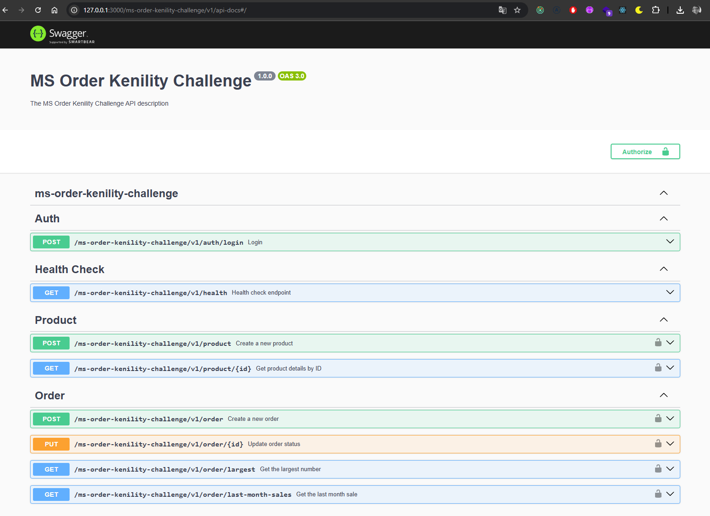
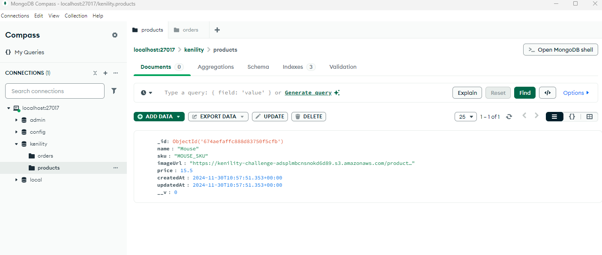
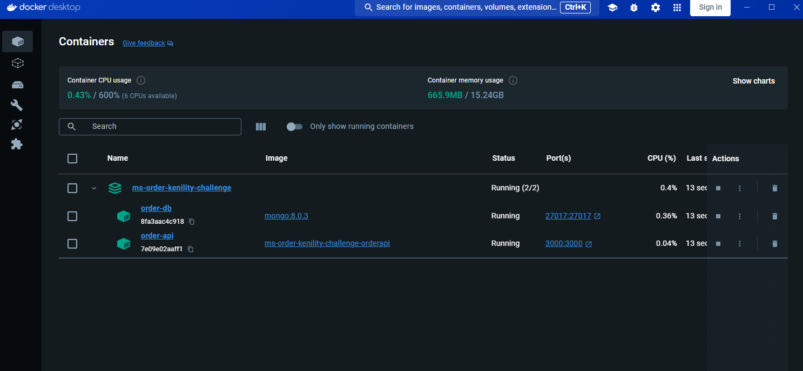

# Kenility Challenge

This project is an API for order and product management, developed as part of the Kenility challenge. The API is built using NestJS and MongoDB, and provides endpoints to create, update, delete and query products and orders.

## Run Locally

Clone the project

```bash
  git clone https://github.com/willyGaleano/ms-order-kenility-challenge.git
```

Create environment variables

```properties
# Common
APP_NAME=ms-order-kenility-challenge
HTTP_PORT=3000
NODE_ENV=development
LOG_LEVEL=debug
ENVIRONMENT=local
LOGGER_MESSAGE_KEY=msg

# Database
MONGODB_PORT=27017
MONGO_INITDB_DATABASE=kenility
MONGODB_URI=mongodb://localhost:27017/kenility

# AWS
AWS_ACCESS_KEY_ID=your_aws_access_key_id
AWS_SECRET_ACCESS_KEY=your_aws_secret_access_key
AWS_REGION=us-east-1
AWS_S3_BUCKET_NAME=your_s3_bucket_name

# Product
IMAGE_FILE_MAX_SIZE=1048576 # 1MB
ALLOWED_IMAGE_MIMETYPES='image/jpeg,image/png,image/jpg'

# JWT
JWT_SECRET=your_jwt_secret
JWT_EXPIRES_IN=1d
JWT_IGNORE_EXPIRATION=false
```

Lifting containers

```bash
  docker-compose up -d
```

## User Admin

For practical purposes we will work with a fixed user that will allow us to log in and generate a valid token.

```typescript
export const USERS_ADMIN: UserAdmin[] = [
  {
    id: 'admin',
    password: 'adminpassword123',
    email: 'admin@gmail.com',
  },
];
```

## Documentation

[Swagger API Documentation](http://127.0.0.1:3000/ms-order-kenility-challenge/v1/api-docs)

## Screenshots







## Tech Stack

**BackEnd** Node, Express, Typescript, Nestjs, MongoDB, Mongoose, CQRS, JWT, Swagger, Docker

**Cloud:** AWS SDK, S3 Client

## Author

- [@willyGaleano](https://github.com/willyGaleano)